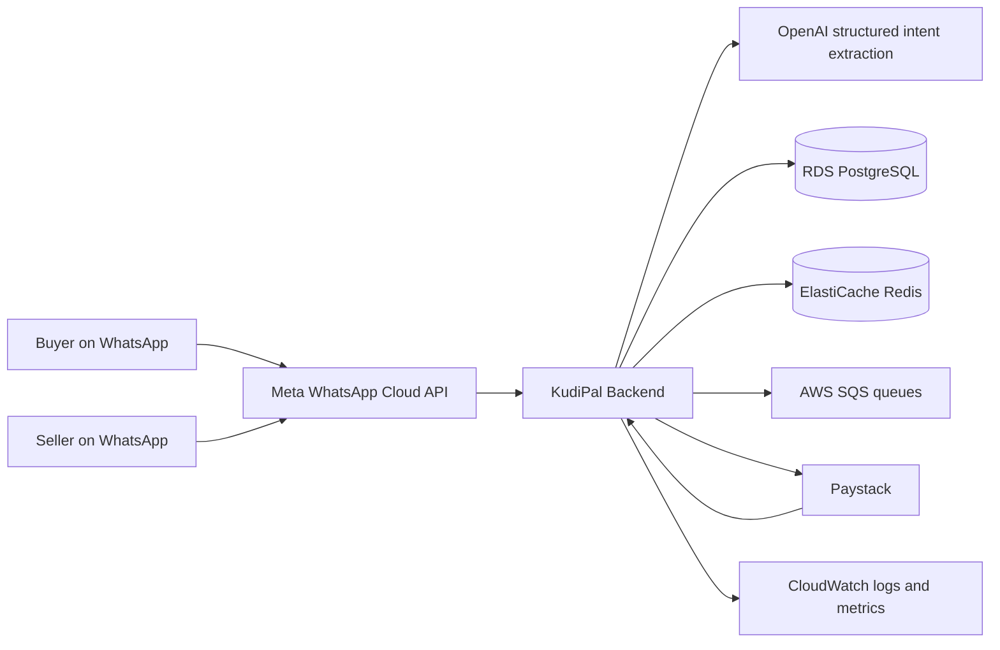
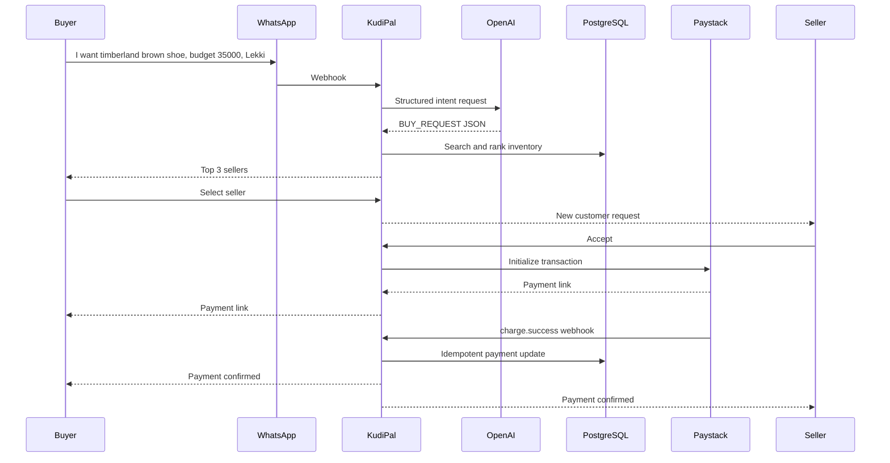

# KudiPal Architecture

KudiPal is a WhatsApp-first commerce and business operating system for African SMEs. The backend is a Java 21 Spring Boot 3 service backed by PostgreSQL, Redis, AWS SQS, Paystack, Meta WhatsApp Cloud API, and OpenAI structured outputs.

## System Context

## Buyer Journey

## Ranking

Seller ranking uses:

- 40 percent distance or location fit
- 30 percent price fit
- 20 percent reputation
- 10 percent response speed

Product relevance is a filter before scoring so unrelated inventory does not rank simply because it is nearby or cheap.

## Scale Notes

The target scale of 1 million SMEs requires tenant-aware data access, partitioning hot event tables by month at higher volume, SQS decoupling for webhook bursts, Redis-backed rate limits, read replicas for analytics, and asynchronous insight generation.
